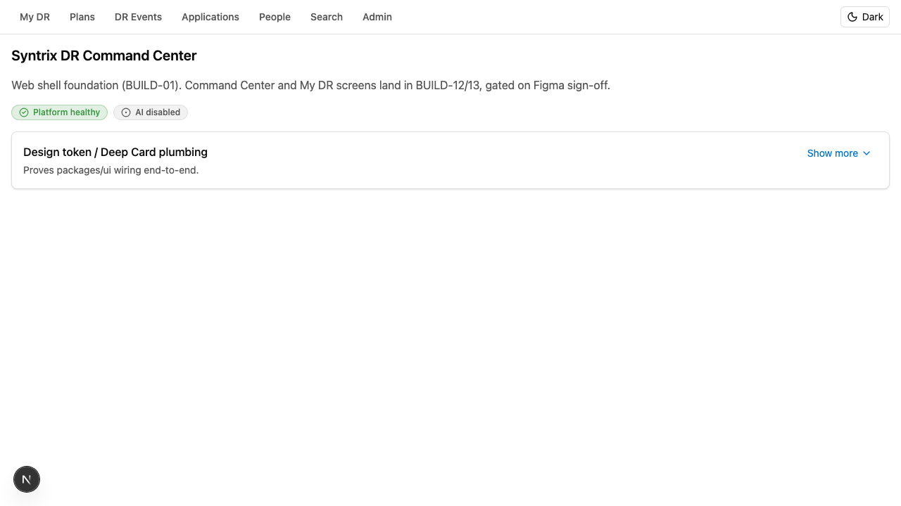
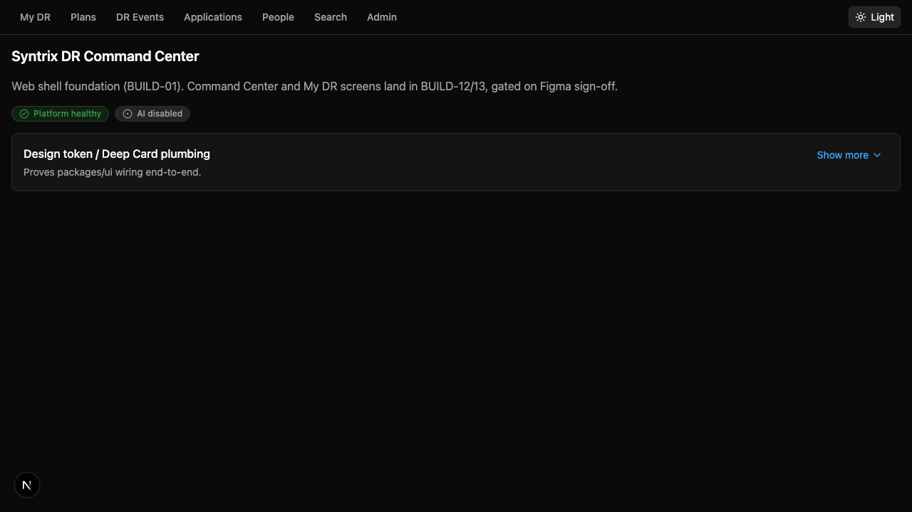
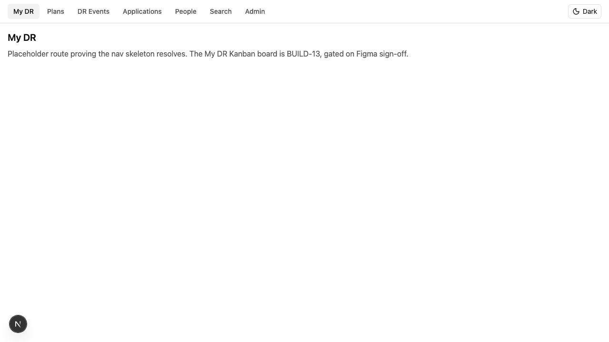
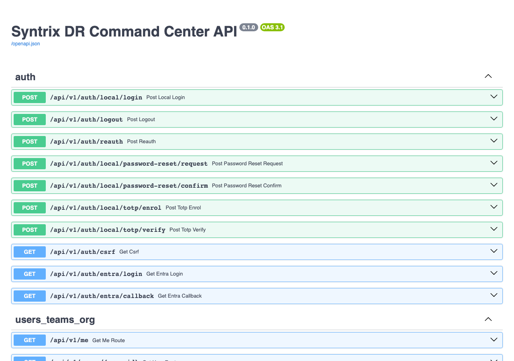
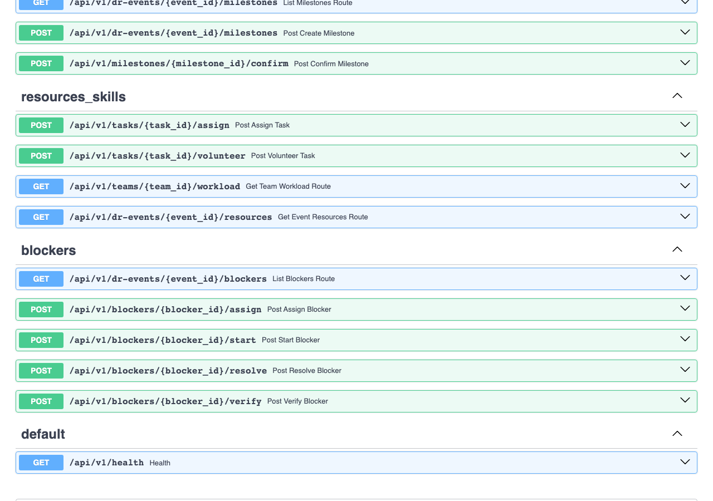

# Syntrix DR Command Center (SyntrixDR)

Syntrix DR Command Center — a real-time, AI-assisted internal command platform for planning, executing, validating,
failing back, auditing and reporting disaster-recovery exercises and real incidents from one live model.
Manual-first: every critical workflow works with AI disabled.

**Repository:** https://github.com/adommeti/SyntrixDR (private) · **Code name:** `drcc` (env prefix `DRCC_`, image and resource names)  
**Status:** V1 POC in build — BUILD-01 … BUILD-07 merged (latest tag `v0.07.0`), BUILD-08 in progress.
Spec frozen 2026-09-11, reconciled 2026-09-12 (`docs/spec/FREEZE_ADDENDUM.md`).

## Screenshots

Captured 2026-10-08 from the local stack (`make dev` + API + web). The web shell is the BUILD-01 foundation: navigation,
light/dark themes, degraded banner and the shared `@drcc/ui` primitives. The Command Center and My DR screens land in
BUILD-12/13, gated on Figma sign-off; until then the product surface is the API.

| Web shell — light | Web shell — dark |
|---|---|
|  |  |

| My DR route (placeholder until BUILD-13) | API reference (`/docs`) |
|---|---|
|  |  |



## What is built so far

| Increment | Tag | Delivered |
|---|---|---|
| BUILD-01 | `v0.01.0` | Production-shaped local foundation: monorepo, Docker Compose services, CI on the self-hosted runner, web shell, verify gate |
| BUILD-02 | `v0.2.0` | Identity (Entra OIDC + local fallback, TOTP, reauth, lockout), users, teams, role grants, the RBAC matrix as data |
| BUILD-03 | — | Application catalog, owner slots, tiers, policy definitions with scoped overrides |
| BUILD-04 | `v0.04.0` | Plan templates and versions, the canonical DR Event lifecycle, readiness keys with audited overrides |
| BUILD-05 | `v0.05.0` | Excel plan import: upload, parse, heuristic mapping, reviewable draft Tasks with provenance |
| BUILD-06 | `v0.06.0` | Canonical Task model, Work Streams, HARD/ADVISORY Finish-to-Start dependency DAG with cycle rejection |
| BUILD-07 | `v0.07.0` | Milestones as manual gates, fixed Owning Team / floating assignee, Manager-precedence assignment, live workload |
| BUILD-08 | in progress | Blocker lifecycle with Team-queue routing and tiered escalation (done); Issues, comments, alerts and the typed catalog (next) |

### API surface

68 operations over 12 modules, all under `/api/v1`, documented live at http://localhost:8000/docs.

| Module | Operations | Highlights |
|---|---|---|
| `auth` | 10 | Entra login/callback, local login, password reset, TOTP enrol/verify, reauth, CSRF, logout |
| `users_teams_org` | 4 | `/me`, users, teams |
| `applications_catalog` | 8 | Applications, owner slots, history, tier admin |
| `policies_admin` | 2 | Policy values by scope |
| `plans_import` | 7 | Plans, plan versions, Excel import jobs and accept |
| `dr_events` | 9 | DR Events, activate / cancel / close, participants, readiness |
| `work_streams` | 2 | Shared lanes per Event |
| `tasks_dependencies` | 13 | Task commands (start, block, resume, submit-validation, validate, cancel), metadata PATCH, dependencies, dependency graph |
| `milestones` | 3 | Create, list, confirm |
| `resources_skills` | 4 | Assign, volunteer, Team workload, Event resources |
| `blockers` | 5 | Assign, start, resolve, verify; Event Blocker list with Team-queue filters |
| `default` | 1 | Health |

### Design rules the code enforces

- Every lifecycle change is a named command through the module's transition service; nothing PATCHes a status.
- Every command POST requires an `Idempotency-Key`; a replay returns the original outcome for 24 hours.
- Every state change writes an audit row and an outbox event in the same transaction; audit is append-only.
- Server-side authorization on every mutation; knowing a UUID is never authorization, and foreign objects answer 404.
- Optimistic concurrency with `expected_version`; a stale write is a 409, except the documented Manager-precedence case.
- Scheduled work (Milestone MISSED sweep, Blocker escalation) runs on one Celery beat and audits as `SYSTEM`.
- Frozen specification under `docs/spec/` is read-only on code branches; CI fails any change to it.

## Stack

Next.js (App Router, TypeScript strict, Tailwind, shadcn/ui, TanStack Query) · FastAPI (Python 3.12, Pydantic v2, SQLAlchemy 2,
Alembic) · PostgreSQL 16 + pgvector · Redis + Celery · WebSockets · Azurite/Azure Blob · Entra ID OIDC + Local fallback ·
Synthetic/Anthropic AI adapters · Azure Container Apps + Bicep.

## Quick start (macOS)

```bash
brew install uv node@22 pnpm gh libpq && brew install --cask docker   # once
cp .env.example .env
make dev            # postgres+pgvector, redis, azurite, mailpit
make install        # uv sync + pnpm install + playwright browsers
make db-upgrade
make seed           # golden East US 2 -> Central US scenario, fictitious data only
cd apps/api && uv run uvicorn app.main:app --reload --port 8000 &   # API
pnpm --filter web dev                                               # web on :3000
make verify         # lint + typecheck + tests + migration + contracts drift
```

Mailpit UI: http://localhost:8025 · API docs: http://localhost:8000/docs · Azurite blob: http://127.0.0.1:10000

`make help` lists every target. The ones used most:

| Target | What it does |
|---|---|
| `make verify` | ruff, pyright, pytest, tsc, eslint, prettier, vitest, Next build, Alembic drift check, contracts drift |
| `make test-auth` · `test-domain` · `test-transitions` | pytest by marker |
| `make test-load` | 5,000-Task dependency-graph performance smoke (opt-in) |
| `make db-check` | migrate from an empty database, `alembic check`, downgrade and upgrade one step |
| `make contracts` | regenerate `packages/contracts` from the OpenAPI document and fail on drift |
| `make security` | semgrep, bandit, pip-audit, pnpm audit, gitleaks, SBOM and image scans |
| `make e2e` · `make load-smoke` | Playwright against `E2E_BASE_URL` · k6 against `LOAD_BASE_URL` |

## Repository map

| Path | Purpose |
|---|---|
| `docs/spec/` | Frozen canon (read-only on code branches; CI enforces). Start with `FREEZE_ADDENDUM.md`, `FROZEN_DECISIONS.md`. |
| `docs/adr/` · `docs/reviews/` · `docs/images/` | Engineering decisions · review/sign-off evidence · README screenshots |
| `apps/api` · `apps/web` | FastAPI modular monolith (`app/<module>/{routes,commands,queries,transition_service,policies,models}.py`) · Next.js command center |
| `packages/contracts` · `packages/ui` · `packages/config` | Generated API types · shared UI primitives · shared lint/ts config |
| `infra/bicep` · `infra/docker` · `infra/runner` | Azure IaC · local container init · self-hosted CI runner preparation |
| `tests/e2e` · `tests/load` | Playwright · k6 |
| `scripts/` | `verify.sh`, `security.sh`, `repo-doctor.sh`, `pr-body.sh`, increment helpers |

## Working agreement

One `BUILD-NN` increment = one `feat/build-NN-<slug>` branch = one squash-merged PR titled `BUILD-NN: …`, tagged `v0.NN.0`.
`main` is protected; CI (`.github/workflows/ci.yml`) runs repo-hygiene, spec-frozen check, api, web, security, and e2e (on
`main` or the `e2e` label) on the self-hosted Linux runner (labels `self-hosted, linux, syntrixdr-linux`; host prep in
`infra/runner/README.md`). An independent second-opinion review is mandatory for BUILD-06, 08, 10, 16 and 20.
Verification checklist: `docs/spec/VERIFY.md`. Each merged increment is followed by a `chore: distill` PR that records
the engineering decisions as ADRs under `docs/adr/`.

## Licence

Internal. All rights reserved.
