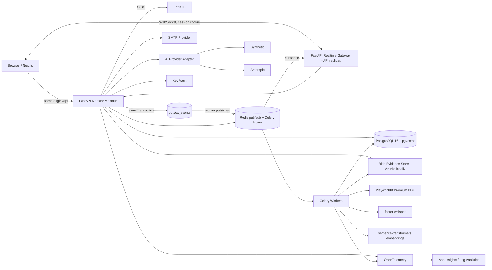
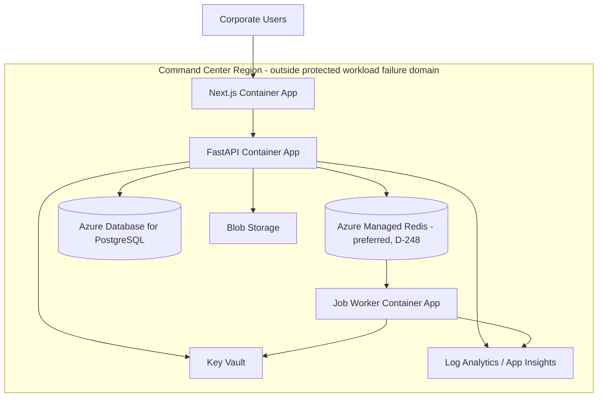

**Reconciled 2026-09-12 against FREEZE_ADDENDUM.md (D-201…D-261).**

# DR Command Center — Frozen V1 Solution Architecture

## Architecture style

[DECIDED] Modular monolith. Domain modules have explicit boundaries but are deployed as one FastAPI application for V1. This maximizes development speed and consistency while retaining future extraction seams.

## Target stack

| Layer | Frozen choice |
|---|---|
| Web | Next.js App Router + React + TypeScript strict |
| UI | Tailwind CSS + shadcn/ui-style accessible primitives |
| Client server-state | TanStack Query |
| Forms | React Hook Form + Zod |
| Visualization | Recharts/shadcn chart primitives for standard graphs; D3 for the Application treemap (true squarified) and custom health dial (D-243) |
| API | Python 3.12 + FastAPI (D-240) |
| Validation | Pydantic v2 |
| Persistence | SQLAlchemy 2.x + Alembic |
| Database | PostgreSQL 16+ |
| Semantic retrieval | pgvector + PostgreSQL FTS |
| Jobs | Celery + Redis from BUILD-01 behind job interfaces; no second scheduler (D-241) |
| Real-time | WebSockets fed by transactional outbox → worker → Redis pub/sub → API replicas (D-242) |
| Files | Azure Blob in Azure; **Azurite** locally; one `ObjectStore` adapter on `azure-storage-blob` (D-217) |
| PDF | Playwright/Chromium print of a dedicated report route/template in the worker container (D-244) |
| Speech-to-text | local faster-whisper in the worker behind a provider interface; Azure AI Speech future adapter (D-232) |
| Identity | Entra ID OIDC via FastAPI; controlled Local fallback in the same session/RBAC system (D-239) |
| Email | provider abstraction; SMTP first |
| AI | provider abstraction: Synthetic + direct Anthropic V1 |
| Embeddings | nomic-embed-text-v1.5, 768d, via sentence-transformers in the worker; adapter-based (D-233) |
| Toolchain | Python 3.12, uv, Node 22 LTS, pnpm workspaces (no Turborepo), Ruff, Pyright, ESLint, Prettier; lockfiles committed (D-240) |
| API contracts | `packages/contracts` generated from FastAPI OpenAPI with `openapi-typescript`; CI fails on drift; Zod only for UI/form/runtime validation (D-251) |
| Tests | pytest + testcontainers-python (ephemeral pgvector Postgres), Vitest + Testing Library, Playwright, k6; ephemeral Redis for Celery integration (D-250) |
| Cloud runtime | Azure Container Apps |
| Managed DB | Azure Database for PostgreSQL |
| Cache/broker (Azure) | Azure Managed Redis (preferred) (D-248) |
| Secrets | Azure Key Vault |
| Telemetry | OpenTelemetry → App Insights/Azure Monitor/Log Analytics |
| IaC | Bicep |
| Local | Docker Compose on MacBook; BUILD-01…21 run end to end locally, Azure credentials needed only for BUILD-22/23 (D-248) |

## Component diagram

Diagram notes: local object store is Azurite, not MinIO (D-217); the Outbox → worker → Redis pub/sub → API replicas → WebSocket edges are the real-time path (D-242); OIDC is handled by FastAPI and the browser reaches the API through same-origin `/api` routing (D-239); PDF, speech and embedding run in the Celery worker (D-244, D-232, D-233).

## Backend modules

The 19 modules below are unchanged. `dr_events` additionally owns the `participants` responsibility: the explicit `dr_event_participants` table and the auto-enrolment rules (Event-scoped role holders; current Task assignees; Blocker owners; any-slot System/Application or Business Owners of in-scope Applications; Work Stream Leads; members or managers of Owning Teams with Tasks in the Event; Global Admins implicit; Auditor/Executive via separately granted global read-only role or per-Event enrolment, never by job title). `identity_auth` consumes participant membership for visibility checks but does not own it. (D-222)

- identity_auth
- users_teams_org
- applications_catalog
- dr_events (incl. participants — D-222)
- plans_import
- work_streams
- tasks_dependencies
- milestones
- blockers
- issues_findings
- validation_evidence
- rto_rpo_health
- resources_skills
- comments_mentions_notifications
- search_documents
- ai_orchestration
- reporting_exports
- policies_admin
- audit_history

## Layering

`API routes → application command/query services → domain policies/transition services → repositories/infrastructure`.

[DECIDED] Lifecycle transitions and invariants live in domain/application services, never scattered through frontend components or route handlers.

## Command/query split

[DECIDED] State changes use explicit commands such as StartDR, StartTask, BlockTask, ResolveBlocker, SubmitValidation, ValidateTask, StartFailback, CloseDR and CancelDR.

[DECIDED] Read endpoints expose dashboard/search/report projections. Raw status field updates are forbidden.

## Authentication topology

[DECIDED] FastAPI owns auth: Entra OIDC via FastAPI; HttpOnly, Secure (prod), SameSite=Lax session cookie; Redis-backed session; CSRF protection on state-changing requests; same-origin `/api` routing from Next.js to FastAPI; WebSocket auth via the same session; Local auth enters the same session/RBAC system; no access tokens in browser JavaScript. (D-239)

## Real-time

[DECIDED] Pipeline (D-242):

1. PostgreSQL transaction commits the source-of-truth mutation. (D-242)
2. A transactional outbox row is written in the same transaction. (D-242)
3. A worker publishes the outbox row to Redis. (D-242)
4. API replicas subscribe to Redis. (D-242)
5. WebSocket clients receive from their connected replica; connected clients invalidate/update TanStack Query caches. (D-242)
6. Container Apps session affinity may be enabled for stability but correctness never depends on it; any replica rebuilds state from PostgreSQL on reconnect. Real-time transport is never the source of truth. (D-242)

## Background jobs

Celery + Redis from BUILD-01 behind job interfaces; no second scheduler. (D-241)

- blocker escalation timers
- SLA/RTO warning/breach evaluation
- document parsing/chunking/embedding (sentence-transformers in the worker — D-233)
- Excel import enrichment
- email retry/fan-out (notification fan-out — D-241)
- report/PDF/CSV/Excel generation (PDF via Playwright/Chromium in the worker container — D-244)
- outbox publishing to Redis for real-time fan-out (D-242)
- speech-to-text transcription via faster-whisper (D-232)
- encrypted package export/import preparation
- retention/legal-hold-aware purge
- re-embedding on embedding-model version changes

## Search/RAG architecture

1. Structured filters/dependencies query PostgreSQL.
2. Lexical matching uses PostgreSQL full-text indexes.
3. Semantic retrieval uses pgvector.
4. Access filters are applied before retrieved content is passed to AI.
5. Structured relation is authoritative when it conflicts with semantic inference.
6. AI response cites supporting document/evidence provenance.

## AI architecture

[DECIDED] Provider adapter selects Synthetic or Anthropic by environment/Admin configuration. Azure AI Foundry is a V2 adapter.

[DECIDED] Read/Recommend/Act are distinct. Act cannot mutate directly; it calls the same application command service as the UI and therefore gets identical RBAC, reauth, transition guards, idempotency and audit.

## Local topology

Docker Compose provides PostgreSQL+pgvector, Redis, Azurite (local Azure Blob emulator, reached through the same `azure-storage-blob` `ObjectStore` adapter) and local SMTP test service (Mailpit). Web/API can run directly on host for fast hot reload or in containers. AI integration can be disabled or enabled with developer-provided provider credentials. BUILD-01…21 run end to end locally with no Azure credentials. (D-217, D-256, D-248)

## Azure topology

[DECIDED] POC public ingress is allowed. Production private ingress/network controls are required. Dev/Test/Prod are isolated.

## Explicit non-architecture choices

- no microservices in V1
- no Kubernetes in V1
- no Pinecone/Chroma
- no AI-specific state store as source of truth
- no client-held provider secrets
- no direct AI mutation bypass
