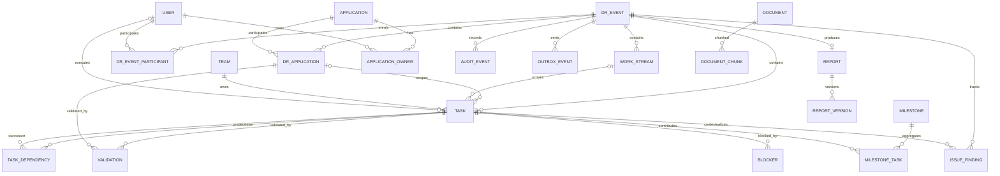

# DR Command Center — Frozen V1 Domain & Data Model

**Reconciled 2026-09-12 against FREEZE_ADDENDUM.md (D-201…D-261).**

## Aggregate roots

### DR Event

Primary live operational container. Contains Event participants, DR Applications, Work Streams, Tasks, Milestones, Dependencies, Blockers, Issues/Findings, policies, timeline, health and reports.

Canonical fields include: UUID, parent Event, type, state, Coordinator, source/target location, planned dates, Event timezone, network-cut timestamp, failback timestamp, closure/cancellation metadata, AI profile, baseline reference, optimistic version.

- [DECIDED] Parent DR Event is a reporting/coordination container only. Children own their lifecycle, `network_cut_at`, RTO/RPO, failover/failback and report; the parent aggregates all descendant DR Applications for health/treemap/reporting and never mutates child state. Standalone subset-Application Events need no parent. (D-219)
- [DECIDED] `network_cut_at` is set by `start-failover` (optional body field; `activated_at ≤ network_cut_at ≤ now()`; defaults to server `now()`; audited). (D-237)
- [DECIDED] Event participants are an explicit `dr_event_participants` table (see Core entities). Default Event visibility is participant-scoped. (D-222)

### Application

Long-lived master record. Holds name, permanent/default Tier, external references, contact/owner relationships and supporting documentation.

### DR Application

Event-specific Application instance. Holds effective Tier/recovery targets, failback requirement, RTO/RPO actuals/pass-fail, validation state, target/forecast, health and business-confirmation metadata.

- [DECIDED] Canonical `status` enum (supersedes schema_v1.sql `dr_application_status`): `NOT_STARTED, RECOVERING, TECHNICAL_VALIDATION, FAILED_OVER, FAILBACK_IN_PROGRESS, COMPLETED`. `COMPLETED` is the common terminal state. (D-208)
- [DECIDED] `failback_required BOOLEAN NOT NULL DEFAULT TRUE`. With `false`, a validated Application moves `TECHNICAL_VALIDATION → COMPLETED` directly. (D-208)
- [DECIDED] RTO clock stops on the `TECHNICAL_VALIDATION → FAILED_OVER` (or `→ COMPLETED`) transition (`technical_validated_at`). (D-208, D-257)

### Plan

Reusable versioned template. Events instantiate/copy a Plan. Subsequent Event edits do not mutate the source Plan.

### Task

Executable unit. May directly reference both a DR Application and a Work Stream. Has fixed Owning Team, optional Current Assignee, expected duration, phase, state, evidence requirements, provenance and optimistic version.

- [DECIDED] Evidence fields: `evidence_required BOOLEAN NOT NULL DEFAULT TRUE`, `evidence_min_count SMALLINT NOT NULL DEFAULT 1`, `verification_note_required BOOLEAN NOT NULL DEFAULT TRUE`. The same fields exist in the Plan/import Task representation. Policy may relax evidence for a class of Tasks; the default is required. (D-226)
- [DECIDED] `needs_specific_validation BOOLEAN`: `false` = standard Owner/Lead validation; `true` = Task additionally carries task-specific validation criteria/evidence requirements. (D-209)
- [DECIDED] Provenance for imported Tasks: `source_import_id`, `source_import_row`. (D-221)

## Core entities

| Entity | Core purpose / frozen rules |
|---|---|
| User | Entra or Local identity; manager/contact/avatar data; audit-safe deactivation |
| Team | Accountability/resource grouping; one V1 queue plus tags |
| Team Membership | User↔Team relationship; V1 admin-maintained org where Graph is unavailable/deferred |
| Skill | V1 capability tag; no proficiency score until V2. `user_skills.proficiency` stays nullable and unused in V1 (D-218) |
| Application Owner | Up to 3 System/Application owners, ordered Primary/Secondary/Tertiary. Primary is Accountable for application validation; any slot may perform it (D-254) |
| Business Owner | Up to 3, ordered Primary/Secondary/Tertiary |
| Tier | T0–T4, SLA/RTO default and health weight |
| Work Stream | Shared execution lane. `stream_type` enum: `NETWORK, STORAGE, DATABASE, APPLICATIONS, MONITORING, VALIDATION, CUSTOM`. Non-completed, non-cancelled Tasks in a `MONITORING` stream raise the monitoring closure warning at Event close (D-227) |
| Milestone | First-class gate; critical manual confirmation by default |
| Task Dependency | FINISH_TO_START V1 with HARD or ADVISORY strength |
| Blocker | Hard execution obstruction with routing/escalation/resolution/verification. Commands `assign/start/resolve/verify`; verify moves VERIFIED→CLOSED atomically (D-211) |
| Issue/Finding | Non-blocking observation, risk, deviation or lesson (D-253) |
| Validation | Persisted record (`validations` table): created `PENDING` by `submit-validation`; closed `APPROVED` or `REJECTED` by the Task/DR Application `validate` command. `IN_REVIEW` and `REMEDIATION` remain in the enum, reserved and unused in V1. No separate REST resource in V1 (D-210) |
| Evidence | Text/note/file/screenshot/log/external link plus malware-scan metadata. INFECTED/unscanned evidence cannot satisfy completion (D-245) |
| Comment/Mention | Cross-Team collaboration and @mentions |
| Alert/Notification/Snooze | Shared acknowledgement + personal snooze |
| DR Event Participant | Explicit `dr_event_participants` row per User per Event. Auto-enrolled when the User: holds an Event-scoped role; is current Task assignee; is Blocker owner; is any-slot System/Application or Business Owner of an in-scope Application; leads a Work Stream; is member or manager of an Owning Team with Tasks in the Event. Global Admins are implicit participants of every Event. Auditor/Executive get a separately granted global read-only role or per-Event enrolment, never by job title (D-222) |
| Policy | Global defaults and scoped Event/Work Stream/Application overrides |
| Override | Auditable reasoned exception/force operation |
| Needs Review | AI/import review queue: OPEN/IN_REVIEW/RESOLVED/DISMISSED |
| Audit Event | Append-only actor/entity/action/before/after history |
| Document/Chunk | Source files + FTS/pgvector semantic chunks |
| Report/Version | Draft-to-published editable narrative with factual snapshot |
| Export Package | Encrypted same-tenant exact-restore/clone package |
| Saved View | Private or shared live-linked filters/layout |
| External Reference | Future ITSM/CMDB identifiers |
| Local Credential | `local_credentials`: Argon2id hash and lockout/TOTP state for Local accounts (D-218, D-235) |
| Password Reset Token | `password_reset_tokens`: emailed single-use reset token, 30-min expiry, `used_at` consumption marker (0002) (D-235) |
| Session | `sessions`: session record for the shared Entra/Local session system; 8 h absolute, 30 min idle (D-218, D-235, D-239) |
| Reauth Grant | `reauth_grants`: 5-minute privileged reauthentication window for high-risk actions (D-218, D-235) |
| Idempotency Key | `idempotency_keys`: per-command `Idempotency-Key` record, retained 24 h (D-215, D-218) |
| Outbox Event | `outbox_events`: transactional outbox row published by the worker to Redis for WebSocket fan-out (D-218, D-242) |
| File Policy | `file_policy`: allowlist / max size / scanning settings (D-218, D-225) |

## Canonical polymorphic target type

[DECIDED] `target_type` enum: `DR_EVENT, DR_APPLICATION, APPLICATION, WORK_STREAM, TASK, TASK_DEPENDENCY, MILESTONE, BLOCKER, ISSUE_FINDING, VALIDATION, IMPORT_JOB, PLAN, PLAN_VERSION, REPORT, DOCUMENT, ALERT`. Used by comments, evidence_items, overrides, needs_review_items, alerts, notifications, audit links and `packages/contracts`. Each table may accept only a subset, enforced by CHECK constraint and/or service. Free-text `target_type` columns in schema_v1.sql are superseded. (D-216)

## Schema lineage

- [DECIDED] `schema_v1.sql` is Alembic revision 0001 (historical basis) and is not otherwise mutated. Revision 0002 carries this reconciliation: enum corrections (D-208), Tier-3 comment fix (D-218), new tables `local_credentials, password_reset_tokens, sessions, reauth_grants, idempotency_keys, outbox_events, dr_event_participants, file_policy` plus indexes/constraints (D-218, D-235), target-type enum (D-216) — with `audit_events.entity_type` staying TEXT under a CHECK constraint on the 31-name audit superset (16 `target_type` labels + 15 admin/identity/configuration names; extending it needs an ADR/spec update and a migration, D-234), evidence fields on `tasks` plus `validations.verification_note` (D-226), `stream_type` (D-227), `dr_applications.rpo_not_applicable BOOLEAN NOT NULL DEFAULT FALSE` with a CHECK enforcing mutual exclusion against `rpo_target_minutes` (D-224), and `documents.embedding_model` / `embedding_dim` plus the pgvector HNSW index on `document_chunks.embedding` (D-233). SQLAlchemy models are hand-written to match; CI runs `alembic check`. (D-247)

## Key invariants

1. Every mutation is authenticated, authorized and audited.
2. AI cannot perform an action the invoking user cannot perform manually.
3. Task state changes go through centralized transition services.
4. Event state changes go through centralized transition services.
5. HARD dependencies block Start unless a permitted audited override exists.
6. ADVISORY dependencies warn but do not block.
7. Directed dependency cycles and self-dependencies are invalid.
8. Owning Team does not change merely because Current Assignee changes Team.
9. Manager assignment authority is own-Team only; Admin/Coordinator may act cross-Team.
10. A BLOCKED Task must have an active Blocker record/reason.
11. Protected completion requires required evidence plus verification/validation note.
12. Application Owner validates application work; Work Stream Lead validates shared work.
13. RTO begins at common network cut in regional DR and stops only on technical Application validation.
14. Recorded RTO/SLA breach is immutable historical fact.
15. RPO retains target + reference/snapshot + recovered-data outcome.
16. Failback is independent from failover and required by default unless feature-enabled exception applies.
17. Baseline is immutable comparison data; live Event execution remains editable/auditable.
18. Structured dependency mappings are authoritative over semantic inference.
19. Audit Events are append-only.
20. CLOSED/CANCELLED Events are operationally terminal V1.
21. A Task reaches COMPLETED only via `READY_FOR_VALIDATION → validate`; an Executor never self-completes. Any System/Application Owner slot may validate application-scoped work; the Work Stream Lead validates shared work. (D-209)
22. A stale `expected_version` write is rejected with `409 CONCURRENCY_CONFLICT`, except a Team Manager's assignment on an own-Team Task whose intervening change was a Coordinator/Admin assignment: it is accepted, the version increments, both actions are audited and the resolution is recorded as `MANAGER_PRECEDENCE`. (D-214)
23. Every command POST carries an `Idempotency-Key`; a replay within 24 h returns the original outcome and performs no second mutation. (D-215)
24. A parent DR Event never mutates child state and cannot CLOSE while any non-cancelled child Event is non-terminal. (D-219)
25. On Blocker verify/close the backing Task returns to IN_PROGRESS; READY_FOR_VALIDATION is reached only through an explicit `submit-validation`. (D-252)
26. Every polymorphic `target_type` value is a member of the canonical enum; each table accepts only its permitted subset. (D-216)

## Tier defaults

| Tier | Default RTO/SLA | Health weight |
|---|---:|---:|
| Tier 0 | 30m | 100 |
| Tier 1 | 60m | 75 |
| Tier 2 | 120m | 50 |
| Tier 3 | 240m | 30 (schema_v1.sql comment corrected; weight = 30) (D-218) |
| Tier 4 | 1440m | 20 |

Admin may change global defaults; Coordinator may apply authorized Event overrides with audit.

## Health

[DECIDED] Health formulas: (D-223)

- **Task Score** = 100 × COMPLETED eligible Tasks / eligible Tasks, where eligible = non-CANCELLED. No extra Blocked penalty.
- **Validation Score** = 100 if the Application's required technical validation for the current recovery phase passed (failback validation when failback is active), else 0.
- **Application Health** = 0.70 × Task Score + 0.30 × Validation Score.
- **Event Health** = Σ(Application Health × effective tier weight) / Σ(effective tier weight); weights T0–T4 = 100/75/50/30/20; no Tier-0 cap.
- **Dial bands:** GREEN ≥ 85; YELLOW 60–84.99; RED < 60.
- **Treemap bands:** GREEN ≥ 85; LIGHT_ORANGE 60–84.99; DARK_ORANGE 40–59.99; RED < 40.
- **Overlays** only worsen the visual band and never change the numeric dial: RTO breach → RED; RPO breach → RED; SLA/RTO warning reached → ≥ DARK_ORANGE; active Blocker on T0/T1 Application → ≥ DARK_ORANGE; active Blocker on T2–T4 Application → ≥ LIGHT_ORANGE.
- **Zero-Application Event:** dial displays "—", not 100.
- A parent Event's health aggregates all descendant DR Applications. (D-219)

## Relationship sketch

## Owner cardinality

For each Application and owner type (`SYSTEM_APPLICATION`, `BUSINESS`):

- slot 1 / Primary: required before coordinated readiness when policy requires owner completeness.
- slot 2 / Secondary: optional.
- slot 3 / Tertiary: optional.
- no fourth slot in V1.
- [DECIDED] Primary System Owner is Accountable for application validation; any System Owner slot may perform it. (D-254)

## RTO/RPO model

DR Application must support:

- `rto_target_minutes`
- `rto_actual_minutes`
- `rto_passed`
- `sla/rto_started_at`
- `technical_validated_at`
- immutable breach timestamp/history
- `rpo_target_minutes`
- `rpo_not_applicable` (explicit RPO-N/A; `true` requires `rpo_target_minutes IS NULL`, CHECK-enforced; satisfies the D-224 RPO readiness HARD_STOP) (0002)
- `rpo_reference_at`
- `rpo_recovered_data_at`
- `rpo_actual_loss_minutes`
- `rpo_passed`

[DECIDED] RTO is measured `network_cut_at → technical_validated_at`; RPO stores target + recovered-data point/result; reports compare target vs actual for both; recorded breaches are immutable. (D-257)

## Evidence storage

- [DECIDED] Evidence/document binaries live in Azure Blob Storage in Azure and **Azurite** locally, behind one `ObjectStore` adapter on `azure-storage-blob`. This supersedes the "MinIO-compatible local object storage" wording in FROZEN_DECISIONS §2.11. (D-217)
- [DECIDED] Malware scanning: Microsoft Defender for Storage in Azure; a local scanner adapter treats an EICAR payload as INFECTED, else CLEAN. The result updates `malware_scan_status`. (D-245)

## Retention

- Audit: 7 years.
- DR Event/Task: 3 years.
- Evidence: classification-configurable, default 3 years.
- Legal hold overrides deletion.
- Reports/imports/semantic indexes track relevant Event/Evidence retention.
- PostgreSQL PITR: 35 days Production.
- Idempotency keys: 24 hours. (D-215)
