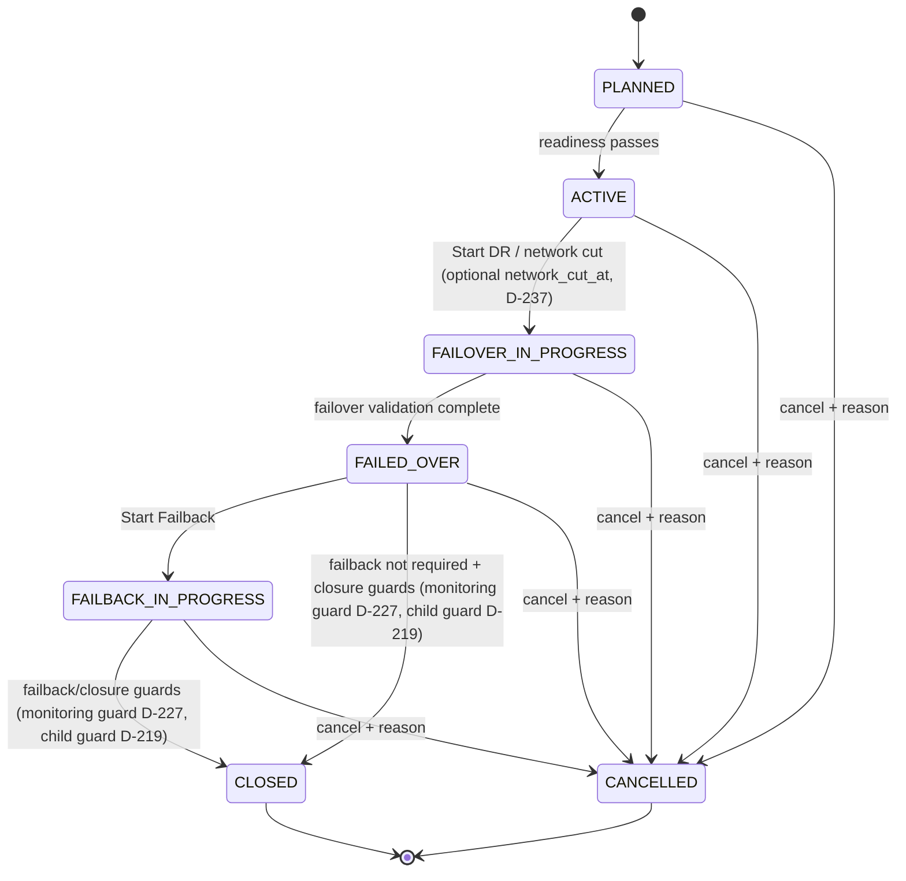
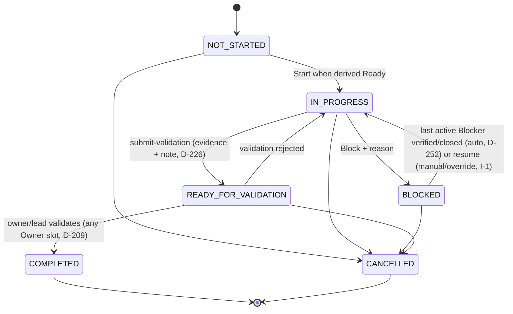
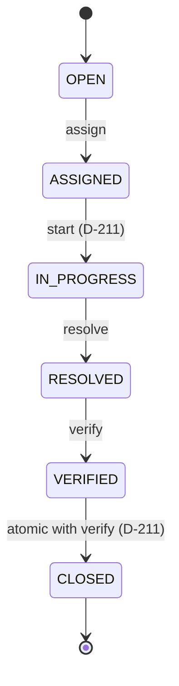
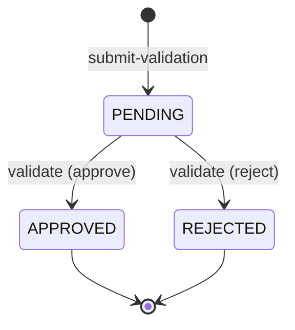

# DR Command Center — Canonical V1 State Machines

**Reconciled 2026-09-12 against FREEZE_ADDENDUM.md (D-201…D-261).**

This file is authoritative. Older discovery-state lists are historical only.

## DR Event

`PLANNED → ACTIVE → FAILOVER_IN_PROGRESS → FAILED_OVER → FAILBACK_IN_PROGRESS → CLOSED`

`CANCELLED` is reachable from any nonterminal state with an audited reason.

- [DECIDED] PLANNED: Plan/scope/readiness can still change.
- [DECIDED] ACTIVE: Event activated, ready for execution/start command.
- [DECIDED] FAILOVER_IN_PROGRESS: common network cut/start occurred; baseline and RTO/RPO start captured.
- [DECIDED] FAILED_OVER: failover recovery/technical validation sufficiently complete.
- [DECIDED] FAILBACK_IN_PROGRESS: explicit Start Failback occurred.
- [DECIDED] CLOSED: successful operational terminal state.
- [DECIDED] CANCELLED: terminated without successful closure; reason mandatory.
- [DECIDED] Event Pause/Resume does not exist in V1; cancellation is the only early exit. (D-207)
- [DECIDED] Create authority: Global Admin and DR Coordinator hold full Event lifecycle authority. An Application/System Owner may create a **PLANNED** Event scoped to their own Application(s) (subset/sub-DR) but cannot `activate`, `start-failover` or any later lifecycle command unless they also hold Admin/Coordinator authority. (D-213)
- [DECIDED] `ACTIVE → FAILOVER_IN_PROGRESS` (`start-failover`) accepts an optional `network_cut_at` with `activated_at ≤ network_cut_at ≤ now()`; it defaults to server `now()`, applies to PLANNED_DR and REAL_INCIDENT Events, and is audited. (D-237)
- [DECIDED] Monitoring closure guard on `→ CLOSED`: any non-cancelled Task in a `MONITORING` Work Stream that is not `COMPLETED` raises an outstanding monitoring closure warning that blocks `close` unless Admin/Coordinator records an audited closure exception override. (D-227)
- [DECIDED] Parent/child rule: a parent DR Event is a reporting/coordination container. Children own their lifecycle, `network_cut_at`, RTO/RPO, failover/failback and report. The parent aggregates all descendant DR Applications for health/treemap/reporting, never mutates child state, and cannot `CLOSE` while any non-cancelled child is non-terminal. Standalone subset-Application Events need no parent. (D-219)



## Task

Canonical enum:

`NOT_STARTED`, `IN_PROGRESS`, `BLOCKED`, `READY_FOR_VALIDATION`, `COMPLETED`, `CANCELLED`

- [DECIDED] **Ready** is derived: status=NOT_STARTED and all HARD dependencies/manual gates are satisfied.
- [DECIDED] BLOCKED additionally has a Blocker record. BLOCKED is backed by ≥1 structured Blocker. (D-252)
- [DECIDED] Protected completion requires required evidence + verification/validation note + Application Owner/Work Stream Lead validation as applicable.
- [DECIDED] Every Task reaches `COMPLETED` only via `READY_FOR_VALIDATION → validate`. There is no Task Skip and no `/tasks/{id}/complete` shortcut. (D-207, D-209)
- [DECIDED] Validator authority: Application-scoped work is validated by an Application/System Owner (any of the up-to-3 slots); shared Work Stream work by the Work Stream Lead. Global Admin/DR Coordinator may validate per RBAC. Executors can never self-complete. (D-209)
- [DECIDED] `needs_specific_validation=false` means *standard* owner/lead validation applies; `true` means the Task additionally carries task-specific validation criteria/evidence requirements. (D-209)
- [DECIDED] Evidence defaults per Task: `evidence_required=true`, `evidence_min_count=1`, `verification_note_required=true`. Normal completion = work done + ≥1 acceptable Evidence Item (attachment/log/screenshot/link/text per policy) + verification note + Owner/Lead validation. Policy may relax evidence for a class of Tasks; the default is required. (D-226)
- [DECIDED] On Blocker verify/close the Task returns to `IN_PROGRESS` (its prior actionable state); it proceeds to `READY_FOR_VALIDATION` only through an explicit `submit-validation`. (D-252)
- [DECIDED] `BLOCKED → IN_PROGRESS` has two paths. (a) Automatic: `POST /blockers/{id}/verify` on the **last** active Blocker of the Task atomically returns the Task `BLOCKED → IN_PROGRESS` in the same transaction (D-252); a verify that leaves other Blockers active does not change the Task. (b) Manual: `POST /tasks/{id}/resume` is used when the Task is BLOCKED but no active Blocker remains (e.g. the Blocker was cancelled/closed by override), or when an authorized override (reason required, audited) resumes the Task despite open Blockers. Both paths emit a `TASK_RESUMED` audit event. (I-1, plan §10)
- [DECIDED] A rejected validation returns the Task to `IN_PROGRESS`. (D-210)



### Assignment conflict rule

- [DECIDED] Manager precedence is an explicit domain override, not a 409. When a Team Manager submits an assignment for a Task owned by their Team with a stale `expected_version`, and the intervening change was an assignment by a DR Coordinator/Global Admin, the Manager's assignment is **accepted** (version increments), both actions are audited, the conflict resolution is recorded as `MANAGER_PRECEDENCE`, and affected users are notified. All other stale writes return `409 CONCURRENCY_CONFLICT`. (D-214)

## Blocker

`OPEN → ASSIGNED → IN_PROGRESS → RESOLVED → VERIFIED → CLOSED`

- [DECIDED] Tier 0 Blocker escalates immediately.
- [DECIDED] Lower tiers use configurable timers.
- [DECIDED] Resolving Blocker never changes Task Owning Team.
- [DECIDED] Owning Team verifies the blocking condition is actually gone before normal Task progression resumes.
- [DECIDED] Four commands drive the six states: `assign → ASSIGNED`, `start → IN_PROGRESS`, `resolve → RESOLVED`, `verify → VERIFIED` then `CLOSED` atomically (both transitions audited). Owning Team accountability never changes. (D-211)
- [DECIDED] Verify/close returns the backing Task to `IN_PROGRESS`; it never advances the Task to `READY_FOR_VALIDATION`. (D-252)
- [DECIDED] The Task transition is a side effect of `verify` only when it closes the **last** active Blocker of the Task: `BLOCKED → IN_PROGRESS` is then applied atomically in the same transaction and emits `TASK_RESUMED`. A verify that leaves other Blockers active does not change the Task. When no active Blocker remains but the Task is still BLOCKED (e.g. Blocker cancelled/closed by override), or when an authorized override (reason required, audited) resumes despite open Blockers, the manual path is `POST /tasks/{id}/resume`. (I-1, plan §10)



## Validation

`PENDING → APPROVED | REJECTED`

- [DECIDED] Validation is a first-class **persisted** record (`validations` table) with **no** separate REST resource in V1. (D-210)
- [DECIDED] `POST /tasks/{id}/submit-validation` creates the record as `PENDING`; `POST /tasks/{id}/validate` and `POST /dr-applications/{id}/validate` close it as `APPROVED` or `REJECTED`. Generic `/validations/{id}/approve|reject` endpoints are not V1. (D-207, D-210)
- [DECIDED] `IN_REVIEW` and `REMEDIATION` remain in the enum, reserved and unused in V1. (D-210)
- [DECIDED] A rejected Task validation returns the Task to `IN_PROGRESS`. (D-210)



## Issue/Finding

`OPEN → IN_REVIEW → RESOLVED | DISMISSED`

- [DECIDED] Issue/Finding is for non-blocking observation, risk, deviation or lesson.
- [DECIDED] It can be linked to Task/Application/Work Stream/Event.
- [DECIDED] It becomes a hard execution stop only if explicitly linked/converted to a Blocker or a policy/gate says so. (D-253)

## Needs Review

`OPEN → IN_REVIEW → RESOLVED | DISMISSED`

- [DECIDED] Used for low-confidence AI/import/semantic suggestions.
- [DECIDED] Managers resolve their scope immediately; Coordinator/Admin can resolve Event-wide items.

## Milestone

`NOT_STARTED → IN_PROGRESS/AT_RISK → READY_FOR_CONFIRMATION → ACHIEVED | MISSED`

- [DECIDED] Critical milestones use manual confirmation by default.
- [DECIDED] Low-risk auto-confirm can be policy-enabled.

## Application recovery

[DECIDED] Application recovery is not reduced to Task state. It has independent RTO/RPO, technical validation, failover/failback and health outcome.

Canonical DR Application status enum (supersedes schema_v1.sql `dr_application_status`): (D-208)

`NOT_STARTED → RECOVERING → TECHNICAL_VALIDATION → FAILED_OVER → FAILBACK_IN_PROGRESS → COMPLETED`

- [DECIDED] `COMPLETED` is the common terminal state. (D-208)
- [DECIDED] `failback_required` defaults `true`. With the toggle set `false`, a successfully validated Application moves `TECHNICAL_VALIDATION → COMPLETED` directly, skipping FAILED_OVER/FAILBACK_IN_PROGRESS. (D-208)
- [DECIDED] The RTO clock stops on the `TECHNICAL_VALIDATION → FAILED_OVER` (or `→ COMPLETED`) transition, i.e. on successful technical Application validation. An already recorded breach is immutable history. (D-208, D-257)
- [DECIDED] Technical validation may be performed by any System/Application Owner slot; the Primary System Owner is Accountable. (D-254)
- [DECIDED] Transition → command map: (I-3, plan §10)
  - `NOT_STARTED → RECOVERING`: side effect of Event `POST /dr-events/{id}/start-failover` for **every** in-scope DR Application, in the same transaction, audited per Application.
  - `RECOVERING → TECHNICAL_VALIDATION`: `POST /dr-applications/{id}/submit-validation` (App Owner slot / Coordinator / Admin). Guard: no FAILOVER-phase Task of the Application in `BLOCKED` or `IN_PROGRESS` unless an audited override with reason is supplied. Policy `application.auto_submit_validation` (default `false`) may auto-fire this command when all FAILOVER-phase Tasks of the Application are `COMPLETED`.
  - `TECHNICAL_VALIDATION → FAILED_OVER | COMPLETED`: existing `POST /dr-applications/{id}/validate` (approval; `COMPLETED` when `failback_required=false`). A rejection returns the Application to `RECOVERING` with a note.
  - `FAILED_OVER → FAILBACK_IN_PROGRESS`: side effect of Event `POST /dr-events/{id}/start-failback` for every Application with `failback_required=true`, in the same transaction, audited per Application.
  - `FAILBACK_IN_PROGRESS → COMPLETED`: `submit-validation` again (failback phase; guard applies to FAILBACK-phase Tasks) followed by `validate` in the failback phase.

```mermaid
stateDiagram-v2
  [*] --> NOT_STARTED
  NOT_STARTED --> RECOVERING: Event start-failover side effect, per app (I-3)
  RECOVERING --> TECHNICAL_VALIDATION: dr-applications/{id}/submit-validation (guard: no FAILOVER Task BLOCKED/IN_PROGRESS unless override; auto via application.auto_submit_validation) (I-3)
  TECHNICAL_VALIDATION --> RECOVERING: validate rejected (note) (I-3)
  TECHNICAL_VALIDATION --> FAILED_OVER: validate approved (failback_required=true); RTO clock stops
  TECHNICAL_VALIDATION --> COMPLETED: validate approved (failback_required=false); RTO clock stops
  FAILED_OVER --> FAILBACK_IN_PROGRESS: Event start-failback side effect, apps with failback_required (I-3)
  FAILBACK_IN_PROGRESS --> COMPLETED: submit-validation + validate in failback phase (I-3)
  COMPLETED --> [*]
```
